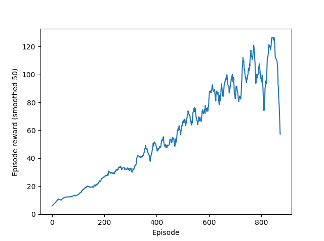

# A3C PyTorch

This repo contains a synchronous (A2C) and asynchronous (A3C) PyTorch implementation of Advantage Actor Critic,
presented by [Mnih et al.](https://arxiv.org/pdf/1602.01783.pdf).

The [OpenAI baseline](https://github.com/openai/baselines/blob/master/baselines/a2c/a2c.py) was used as a reference.

## What is A3C?
A3C is a *policy gradient, Actor-critic* algorithm.

The **Critic** model estimates the value of a state.\
The **Actor** model enacts the policy, i.e. which actions to take.

In A3C, we estimate the **Advantage function** to reduce the variance of the policy gradient 
(taking fewer "bad" steps when we update the parameters).\
The Advantage function is the difference between our value-action estimates and value estimates.

Unlike DQN, A3C doesn't need expensive sweeps over a replay memory to train.

## How to run
There is a test script for running both versions of the algorithm on `CartPole-v1` OpenAI gym environment. 
When in the top level of this repository, run:
```bash
python -m examples.A2C_test 
```
This will train A2C for ~4'000 episodes, achieving an average score of around ~400 in ~30seconds on an average CPU.

Run:
```bash
python -m examples.A3C_test
```
instead to launch the asynchronous algorithm over 2 processes.

Other scripts in the **examples** directory test various A3/2C hyperparameters, such as number of frames in between updates,
or whether the algorithm performs better when the actor and critic share some parameters.

### Results
Currently A2C has only been tested on `CartPole-v1`.



As you can see, the agent improves well over the first few episodes, only becoming unstable when it gets an average 
episode reward of 120.

No benchmarking has been performed on A3C.